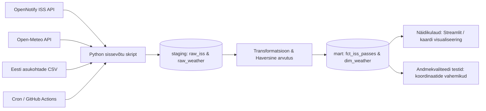

# # Kosmonaudid — Rahvusvahelise Kosmosejaama (ISS) nähtavuse prognoosimine Eesti kohal

## ## Äriküsimus

Projekt lahendab probleemi, kuidas reaalajas tuvastada ja prognoosida Rahvusvahelise Kosmosejaama (ISS) füüsilist nähtavust Eesti eri asukohtades, kombineerides jaama trajektoori reaalsete ilmaandmetega (pilvisus). Kasu saavad astronoomiahuvilised ja fotograafid, kes soovivad jaama palja silmaga kosmoses märgata või pildistada.

**Mõõdikud:**

1. **ISS-i ülelennu nähtavuse indeks** — Süsteemi arvutatud indeks (KÕRGE / KESKMINE / MADAL / PUUDUB), mis põhineb jaama asukohal ja konkreetse Eesti asukoha hetke pilvisusel.
2. **Pilvisuse protsent (%)** — Open-Meteo API-st pärinev reaalajas pilvisuse näitaja Eesti koordinaatidel ülelennu hetkel.
3. **Haversine distants (km)** — ISS-i ja Eesti vaatluspunkti vaheline matemaatiline kaugus maapinnal.

## ## Arhitektuur 



## Andmestik

|Allikas|Tüüp|Ajas muutuv?|Roll|
|-------|----|------------|----|
|OpenNotify ISS API | Jah, reaalajas iga 60s|ISS-i jooksvate koordinaatide (laiuskraad, pikkuskraad) ja ajatempli saamine.|
|Open-Meteo API |Jah, tunni kaupa |Eesti asukohtade reaalajas ilmaandmete (pilvisus protsentides) pärimine.|
|Eesti asukohtade CSVFail (.csv)|Ei, staatiline|Spikker-tabel (seed), mis sisaldab Eesti suuremate linnade ametlikke geokoordinaate.|

## Stack
|Komponent|Tööriist|Sissevõtt|
|-------|------|--------|
|Python (requests raamistik)|
|Transformatsioon|Python (pandas andmetöötlus ja Haversine valem)|
|Andmehoidla|PostgreSQL (pgDuckDB) / Kohalikud organiseeritud CSV failid|
|Näidikulaud|Streamlit (koos interaktiivse kaardikomponendiga)|
|Orkestreerimine|Docker Compose taustaprotsess (tulevikus GitHub Actions / Cron)|

## Käivitamine

```bash
# 1. Klooni repo ja liigu kausta
git clone <teie-repo-url>
cd ISS_Projekt

# 2. Kopeeri keskkonnamuutujad (Vajalik vaid esimesel korral!)
cp .env.example .env

# 3. Käivita kogu süsteem ja näidikulaud taustal
docker compose up -d --build

# 4. Vaata töövoo (pipeline) elavaid logisid ja andmete liikumist
docker compose logs -f pipeline

```

Näidikulaud on brauseris koheselt kättesaadav aadressil: http://localhost:8501

## Saladused ja konfiguratsioon

Kõik projekti seaded ja andmebaasi paroolid on eraldatud koodist ja asuvad kohalikus .env failis. Turvakaalutlustel on .env lisatud .gitignore ja .dockerignore failidesse ning seda GitHubi ei fanta. Repos on kaasas mall .env.example.

**Vajalikud muutujad .env failis:**
Vajalikud muutujad:

| Muutuja | Tähendus | Näide |
|---------|----------|-------|
| `DB_PASSWORD` | PostgreSQL parool | (saladus) |
| ` POSTGRES_PASSWORD ` | | | 
| ` POSTGRES_USER ` | Andmebaasi administraatori kasutaja | praktikum | 
| ` POSTGRES_DB ` | Loodava andmebaasi nimi | iss_andmed | 
| ` DB_PORT_HOST ` | Port, mille kaudu arvuti baasiga suhtleb |55432 |
| ` DASHBOARD_PORT_HOST` | Port, kus avaneb Streamlit veebileht |8501 |

## Andmevoog lühidalt

1. **Sissevõtt** — Pythoni skript teeb üle veebi päringud OpenNotify API-sse (ISS asukoht) ja Open-Meteo API-sse (Eesti ilm).
2. **Laadimine** — Andmed laaditakse `staging` kihti
3. **Transformatsioon** — Pandas loeb toorandmed, arvutab Haversine valemi abil jaama kauguse Eestist ning määrab pilvisuse põhjal nähtavuse hinde. Puhas tulemus salvestatakse mart kihti (data/clean_iss_weather.csv).
4. **Testimine** — 3 andmekvaliteedi testi kontrollivad korrektsust
5. **Näidikulaud** — Streamlit loeb puhtad andmed ja kuvab jaama teekonda kaardil ning näitab tabelis järgmiste ülelendude ilmaprognoosi.

## Andmekvaliteedi testid


1. Koordinaatide vahemiku kontroll – Laiuskraadid peavad jääma vahemikku [-90, 90] ja pikkuskraadid[-180, 180].
2. Tühjade väärtuste (NaN) kontroll – Kriitilised väljad (ISS laiuskraad, pilvisus) ei tohi olla tühjad.
3. Andmetüüpide kontroll – kontrollitakse, et pilvisuse väärtus on alati numbriline (täisarv vahemikus 0-100)

Testide tulemused: salvestatakse otse töövoo logides(docker compose logs pipeline) andmete sissevõtu ajal.

## Projekti struktuur

```
.
├── README.md                  
├── compose.yml               
├── Dockerfile                
├── .env.example              
├── .gitignore                
├── .dockerignore             
├── requirements.txt          
├── data/                     
│   ├── raw_iss_weather.csv   
│   └── clean_iss_weather.csv 
├── app/
│   └── app.py                
├── scripts/
│   └── run_pipeline.py       
└── docs/
    ├── arhitektuur.md        
    └── progress.md           
```
## Kokkuvõte, puudused ja võimalikud edasiarendused

**Kokkuvõte:**
-Kogu Dockeri infrastruktuur (andmebaas, pipeline, dashboard) on püstitatud ja töötab ühtses võrgus automaatselt.
-Andmete sissevõtt kahest erinevast API-st.

**Puudused:**
-  Andmeid kogutakse hetkel lokaalselt – kui arendaja arvuti on suletud, siis andmevoog peatub.

**Mis edasi:**
- Saab lisada automaatne e-maili mis saadab meile sõnumi, kui ISS on reaalselt selge taevaga Eesti kohalt üle lendamas.

## Meeskond

| Nimi | Roll |
|------|------|
| Natalja Pilipenko | [Roll] |
| Liisa Rikanson | [Roll] |

