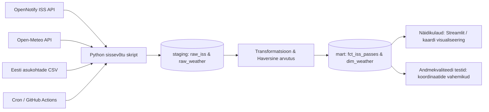

# KOSMONAUDID : ISS-i trajektoor ja nähtavus Eesti kontekstis

## Äriküsimus

Millal, kus ja milliste tingimuste korral on Rahvusvaheline Kosmosejaam (ISS) Eesti territooriumilt palja silmaga nähtav ning milline on selle reaalajas trajektoor võrreldes Eesti koordinaatidega?

Rahvusvaheline Kosmosejaam (ISS) tiirleb ümber Maa kiirusega umbes 28 000 km/h ning selle koordinaadid muutuvad pidevalt. See on ideaalne andmeallikas dünaamilise andmetorustiku loomiseks.

## Mõõdikud

1. **Nähtavuse aken** — Aeg, mil ISS on horisondist kõrgemal kui 10 kraadi Eesti kohal (arvutatakse ISS-i asukoha asimuudi ja elevatsiooni nurga põhjal Tallinna/Tartu koordinaatide suhtes).
2. **Pilvisuse indeks** — Ilmaprognoosi pilvisuse protsentuaalne näitaja (0–100%) ISS-i ülelennu hetkel. Kui pilvisus on suurem kui 50%, on jaama nähtavuse tõenäosus madal.
3. **Hetkeline kaugus** — Distants (kilomeetrites) ISS-i suborbitaalse punkti ja Eesti keskpunkti vahel, mis arvutatakse Haversine'i valemi abil.

## Andmeallikad

| Allikas | Tüüp | Ajas muutuv? | Roll |
| ----- | ----- | ----- | ----- |
| [Open Notify API](http://api.open-notify.org/iss-now.json) | ISS asukoha API | Jah, reaalajas (uueneb iga 1–2 sekundi järel). Meie pipeline pärib andmeid tihedamalt ülelennu akna ajal. | Põhiandmevoog |
| [Open-Meteo API](https://api.open-meteo.com) | Ilmaandmete API | Jah, uueneb kord tunnis (prognoos ja hetkeseis). | Täiendav andmeallikas |

## Andmevoog

Täpsem kirjeldus: [`docs/arhitektuur.md`](docs/arhitektuur.md)

## Andmebaasi kihid 

| Kiht | Roll |
|------|------|
| `staging` | Hoiab allika andmeid töötlemata kujul. |
| `mart` | Hoiab transformeeritud ja ärilogikat sisaldavaid tabeleid. |

## Tööjaotus
| Roll | Vastutus | Täitja |
|------|----------|--------|
| Andmeallika omanik | Kirjutab sissevõtu loogika, hoiab API-t töös | Natalja|
| Transformatsioonide omanik | Kirjutab mart kihi mudelid ja mõõdikute arvutuse | Natalja |
| Kvaliteedi omanik | Kirjutab testid ja vaatab läbi ebaõnnestunud kontrollid | Liisa |
| Näidikulaua omanik | Ehitab näidikulaua ja seob selle äriküsimusega | Liisa |

## Riskid

| Risk | Mõju | Maandus |
|------|------|---------|
| ISS-i kiirus | ISS lendab Eestist üle väga kiiresti (mõne minutiga) ning 15-minutise intervalliga andmete korjamisel magame ülelennu maha | Muudame skripti loogikat: tavapäraselt küsime andmeid kord tunnis, aga kui ISS jõuab Euroopa koordinaatidele, tihendame päringuid iga 10 sekundi tagant |
| Usaldusväärsus | Tasuta kosmose-API-del on päringute limiit (Rate limit) või nad on tihti maas. | Lisame koodi try-catch ploki ja salvestame viimase teadaoleva trajektoori kiiruse, et vajadusel asukohta ajutiselt interpoleerida (ennustada). |

## Privaatsus ja turve 

- Projektis kasutatakse eranditult avalikke astronoomilisi ja meteoroloogilisi andmeid. Isikuandmeid (GDPR) ei koguta ega töödelda.
- Kõik tundlikud andmed (andmebaasi paroolid, API võtmed) hoitakse kohalikus `.env` failis, mis on lisatud `.gitignore` faili ja mida GitHubi ei lükata.
- Projekti juurkaustas on loodud `.dockerignore` fail. See tagab, et `docker compose build` käsu ajal ei kopeerita kohalikku `.env` faili ega lokaalseid arendusfaile (nt `.venv`, `__pycache__`) Docker konteineri kujutise (image) sisse. See välistab tundlike andmete lekkimise konteinerist.

