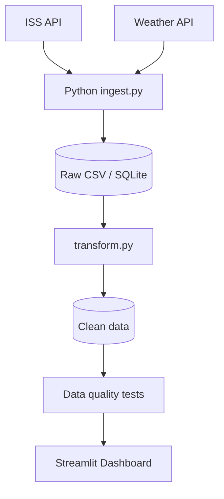

# KOSMONAUDID : ISS-i trajektoor ja nähtavus Eesti kontekstis

## Äriküsimus

[Millal ja kui kaua on Rahvusvaheline Kosmosejaam (ISS) Eestis nähtav ning kuidas selle trajektoor ja nähtavus ajas muutuvad?]

[Projekt aitab visualiseerida ISS liikumist Eesti kohal ning hinnata nähtavust ilmastiku põhjal.]

**Mõõdikud:**

1. [ISS nähtavuse kestus - Arvutatakse, kui kaua (minutites) ISS on Eestis nähtav ühe ülelennu jooksul.]
2. [ISS ülelendude arv päevas - Loendatakse, mitu korda ISS liigub Eesti kohal ühe päeva jooksul.]
3. [Keskmine nähtavuse kvaliteet - Arvutatakse keskmine nähtavuse kvaliteet ilmastikuandmete põhjal, kasutades pilvisuse protsenti ja ilmastikutingimusi.]

## Arhitektuur



Täpsem kirjeldus: [`docs/arhitektuur.md`](docs/arhitektuur.md)

## Andmestik

| Allikas | Tüüp | Ajas muutuv? | Roll |
|---------|------|--------------|------|
| [Open Notify API](http://api.open-notify.org/iss-now.json) | ISS asukoha API | Jah, iga paari sekundi järel | Põhiandmevoog |
| [Open-Meteo API](https://api.open-meteo.com) | Ilmaandmete API | Jah, vähemalt kord tunnis | Täiendav andmeallikas |

## Stack

| Komponent | Tööriist |
|-----------|---------|
| Sissevõtt | Python |
| Transformatsioon | Pandas |
| Andmehoidla | SQLite / CSV |
| Näidikulaud | Streamlit |
| Orkestreerimine | Cron / Python scheduler |


## Käivitamine

```bash
# 1. Klooni repo ja liigu kausta
git clone <repo-url>
cd <projekti-kaust>

# 2. Kopeeri keskkonnamuutujad
cp .env.example .env
# Muuda .env failis paroolid ja muud seaded vastavalt vajadusele

# 3. Käivita teenused
docker compose up -d --build

# 4. [Vabatahtlik: käivita sissevõtt käsitsi esimesel korral]
# docker compose exec pipeline python scripts/run_pipeline.py run-all
```

Airflow (kui kasutatakse): http://localhost:8080 (kasutaja: airflow / parool: airflow)
Näidikulaud: http://localhost:[PORT]

## Saladused ja konfiguratsioon

Kõik saladused (paroolid, API võtmed, andmebaasi URL-id) on `.env` failis. Repos on ainult `.env.example`, mis näitab vajalike muutujate struktuuri ilma tegelike väärtusteta. Päris `.env` faili ei tohi GitHubi panna - see on `.gitignore`-s.

Vajalikud muutujad:

| Muutuja | Tähendus | Näide |
|---------|----------|-------|
| `DB_PASSWORD` | PostgreSQL parool | (saladus) |
| `[teised]` | ... | ... |

## Andmevoog lühidalt

1. **Sissevõtt** — [API tagastab ISS reaalajas asukoha (laius- ja pikkuskraadid), API tagastab ilmaandmed Eestis, sealhulgas pilvisuse ja ilmastikutingimused.]
2. **Laadimine** — Andmed laaditakse `staging` kihti
3. **Transformatsioon** — [ISS ja ilmaandmed puhastatakse ning ühendatakse ajatempli alusel. Arvutatakse nähtavuse kestus, ülelendude arv ja nähtavuse kvaliteet.]
4. **Testimine** — [Vähemalt 3 andmekvaliteedi testi kontrollivad andmete korrektsust ja täielikkust.] andmekvaliteedi testi kontrollivad korrektsust
5. **Näidikulaud** — [Streamlit dashboard kuvab ISS trajektoori, nähtavuse kestust, ülelendude arvu ja ilmastikutingimusi Eestis.]

## Andmekvaliteedi testid

Projekt kontrollib järgmist:

1. ISS koordinaadid ei ole tühjad
2. Laius- ja pikkuskraadid jäävad lubatud vahemikku
3. Ajatempli väärtused ei ole tulevikus

Testide tulemused kuvatakse terminalis ning salvestatakse logifaili.

## Projekti struktuur

```text
.
├── README.md
├── docker-compose.yml
├── Dockerfile
├── requirements.txt
├── .env.example
├── .gitignore
│
├── docs/
│   ├── arhitektuur.md
│   └── progress.md
│
├── scripts/
│   ├── ingest.py
│   ├── transform.py
│   └── run_pipeline.py
│
├── data/
│
├── tests/
│
└── app/
    └── app.py
```

## Kokkuvõte, puudused ja võimalikud edasiarendused

**Kokkuvõte:**
- [ Projekti arhitektuur on planeeritud
- Valitud on andmeallikad
- Määratud on peamised mõõdikud]

**Puudused:**
[- Andmete ajalooline salvestamine pole veel realiseeritud
- Dashboard on arendamisel]

**Mis edasi:**
- Luua ingest.py skript
- Salvestada ISS andmed SQLite andmebaasi
- Luua Streamlit dashboard
- Lisada Docker tugi

## Meeskond

| Nimi | Roll |
|------|------|
| Liisa Rikanson | [Roll] |
| Natalja Pilipenko| [Roll] |
| Kärt Siilats | [Roll] |


